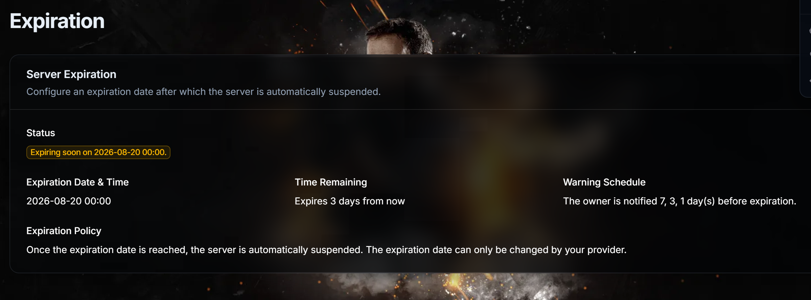
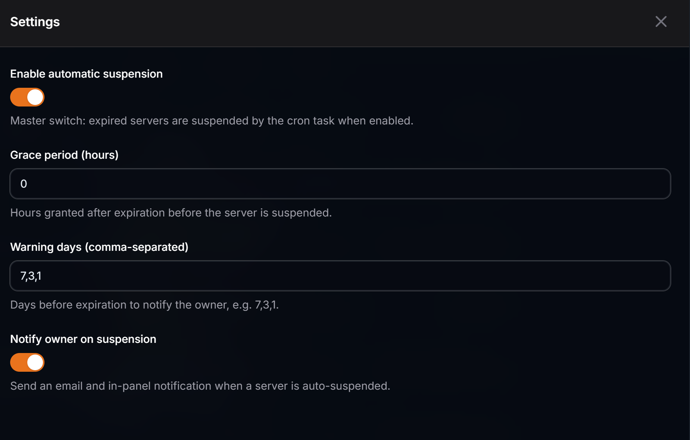

# Server Expiry & Auto-Suspend


Out-of-the-box expiration dates and automated suspension for **Pelican Panel**
servers. Set an expiry date per server and let the plugin suspend it on time,
send reminders before it happens, and revive it automatically on renewal.

## Screenshots

The expiration page for the server owner, shown in the server sidebar:



Plugin settings in the admin panel, under Admin Area → Plugins → Settings:



## Features

- **Expiration field** — set an exact expiration date/time per server (blank = permanent).
- **Server edit tab** — an "Expiration" tab on the admin server edit form.
- **Creation wizard step** — set an expiration date while creating a server.
- **Status badges** — "Expires At" column in the admin server list:
  - <span style="color:#6b7280">gray</span> = permanent,
  - <span style="color:#16a34a">green</span> = active,
  - <span style="color:#f59e0b">yellow</span> = expiring within the warning window,
  - <span style="color:#dc2626">red</span> = expired.
- **Client info page** — an "Expiration" page in the server sidebar visible to
  all server members showing the expiration status, date, time remaining and
  the warning/suspension policy. It is **read-only**: the expiration date can
  only be changed by the provider via Edit Server → Expiration (admin panel).
- **Auto-revive on renewal** — when an admin sets a new (future) expiration
  date on an expiry-suspended server, the server is automatically unsuspended
  via `SuspensionService` and the warning thresholds reset.
- **Custom suspension banner** — when a server is suspended because it expired,
  the generic "server conflict" banner is replaced by a dedicated expiration
  banner with the expiry date and a "contact your service provider to renew"
  note (clients cannot change the expiration date themselves).
- **Auto-suspend command** — `pelican:suspend-expired-servers` runs every minute
  via Laravel's scheduler and suspends expired servers through Pelican's native
  `SuspensionService` (marks `ServerState::Suspended` **and** tells Wings to
  re-sync the server state via the daemon API).
- **Expiry warnings** — `pelican:send-expiry-warnings` notifies owners by mail +
  in-panel notification at 7, 3 and 1 day(s) before expiration (configurable,
  idempotent per threshold).
- **Owner notifications** — mail + in-panel database notification to the owner on
  warning **and** on suspension.
- **Grace period** — extra hours granted after expiration before suspension.
- **Settings page** — a Settings action on the plugin row in Admin Area → Plugins
  (`.env`-driven): auto-suspend toggle, grace period, warning days, owner notification.

## Lifecycle

1. **Pre-expiration (warning stage)** — when a server enters a warning window
   (default 7, 3 and 1 day(s) before `expires_at`), the owner receives an email
   and an in-panel notification. Each threshold is sent only once per server.
2. **Expiration (suspension stage)** — once `expires_at` (minus optional grace
   hours) is reached, `SuspendExpiredServersCommand` calls Pelican's
   `SuspensionService`, which marks the server as suspended in the database and
   triggers a daemon sync so Wings takes the server offline. On the client
   panel, the server's "Expiration" page shows a dedicated banner instead of
   the generic conflict banner.
3. **Post-suspension notification** — the owner receives a final email and
   in-panel notification explaining the server was suspended due to expiration.
4. **Renewal** — the provider sets a new expiration date (or clears it) via
   Edit Server → Expiration in the admin panel. The server is automatically
   unsuspended and warning thresholds reset so reminders start again. Clients
   see a read-only "Expiration" page with status and countdown information.

## Requirements

- [Pelican Panel](https://pelican.dev/) (current release; `canary` works too)
- PHP 8.2+
- A running queue worker (notifications are queued)
- A cron entry for the suspend task (see below)

## Installation

1. Copy this folder to `<panel>/plugins/server-expiry/` (folder name must match
   the `id` in `plugin.json`).
2. Run `php artisan p:plugin:install` and select the plugin (or use the Import
   button in Admin Area → Plugins).
3. The migration adds the `expires_at` column automatically.

> Download the latest release ZIP from the [Releases](https://github.com/3bdulrahmanOthman/server-expiry/releases)
> page of this repository, or enable the plugin's `update_url` for one-click
> updates from the panel.

## Cron setup

The plugin registers `pelican:suspend-expired-servers` in Laravel's scheduler, so
you only need the standard panel cron running. Verify it exists with `crontab -e`:

```cron
* * * * * php /var/www/pelican/artisan schedule:run >> /dev/null 2>&1
```

The check runs every minute (`withoutOverlapping`). Optional per-run grace
override (manual run only):

```bash
php /var/www/pelican/artisan pelican:suspend-expired-servers --grace-hours=24
```

## Configuration

Set these in the panel `.env` (or use the plugin's Settings page in
Admin Area → Plugins):

```dotenv
SERVER_EXPIRY_AUTO_SUSPEND=true        # master switch for auto-suspension
SERVER_EXPIRY_GRACE_HOURS=0            # hours after expiry before suspension
SERVER_EXPIRY_WARNING_DAYS=7,3,1       # warning thresholds (days before expiry)
SERVER_EXPIRY_NOTIFY_ON_SUSPEND=true   # send mail + panel notification on suspend
```

Full defaults live in `config/server-expiry.php`:

| Config key | Env var | Default | Description |
| --- | --- | --- | --- |
| `auto_suspend_enabled` | `SERVER_EXPIRY_AUTO_SUSPEND` | `true` | Disables the suspend step when `false` |
| `grace_period_hours` | `SERVER_EXPIRY_GRACE_HOURS` | `0` | Grace period in hours before suspension |
| `warning_days_notice` | `SERVER_EXPIRY_WARNING_DAYS` | `7,3,1` | Warning thresholds in days before expiry |
| `notify_owner_on_suspend` | `SERVER_EXPIRY_NOTIFY_ON_SUSPEND` | `true` | Send mail + database notification to the owner |

## Development

Set `PANEL_PLUGIN_DEV_MODE=true` in `.env` so plugin errors throw instead of
marking the plugin `errored`, then watch `storage/logs/laravel.log`. Clear
caches after changes:

```bash
php artisan optimize:clear
```

Run the lint and style checks locally before contributing:

```bash
find . -name '*.php' -exec php -l {} \;
./vendor/bin/pint
```

## Uninstall

Admin Area → Plugins → Uninstall. The `expires_at` column is removed by the
migration rollback.

## Support

Found a bug or want a feature? Open an issue on the
[issue tracker](https://github.com/3bdulrahmanOthman/server-expiry/issues).

## License

[MIT](LICENSE) © fiverr.com/mrabdulrahman_